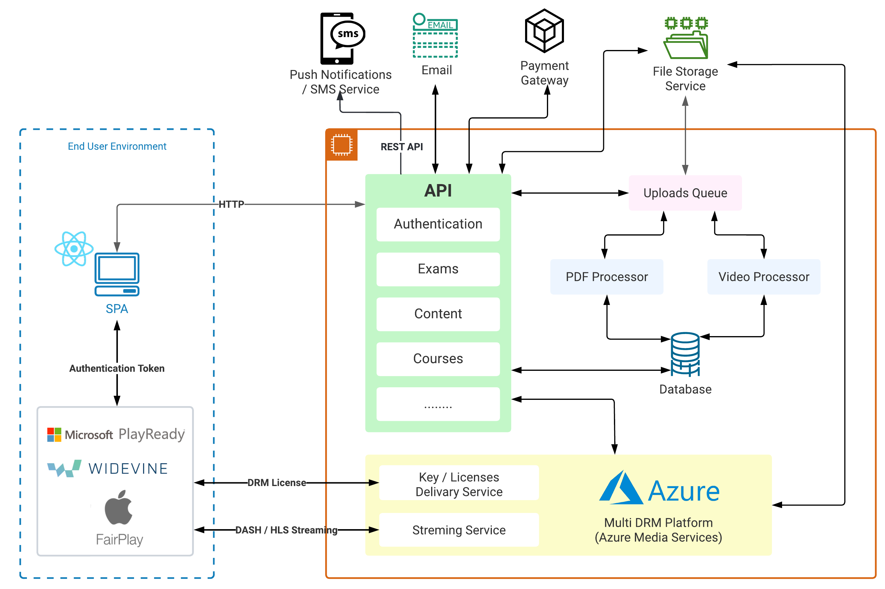
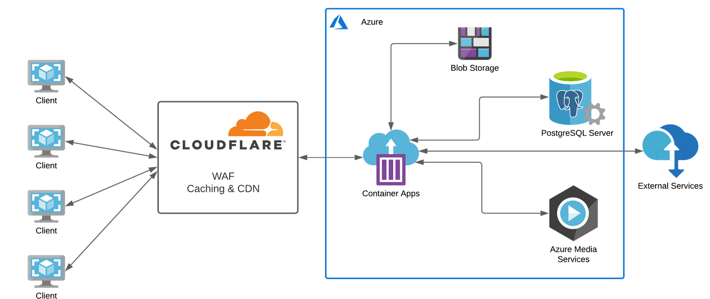

# Administration Manual - Lumen

This manual provides a overview on how to deploy & perform administrative tasks on the lumen platform.

This guide has mainly 4 parts.

1. Application Architecture
2. Deployment Guidelines & Requirements
   - Includes database configuration & seeding
3. Local Development Setup
4. CI/CD Setup

The key words "MUST", "MUST NOT", "REQUIRED", "SHALL", "SHALL
NOT", "SHOULD", "SHOULD NOT", "RECOMMENDED", "MAY", and
"OPTIONAL" in this document are to be interpreted as described in
[RFC 2119](https://datatracker.ietf.org/doc/html/rfc2119).

# Architecture



# Deployment

## Prerequisites

- Billing enabled Azure cloud account
- Azure media services account, storage account & other required services for those.
  - Media Services: https://learn.microsoft.com/en-us/azure/media-services/latest/account-create-how-to
  - Storage Account: https://learn.microsoft.com/en-us/azure/storage/common/storage-account-create?tabs=azure-portal
- Create an account on Stripe
- Account on MailJet
- Domain name registration for organization subdomains
- [Optional] docker installed if deploying locally

## Quick Deployment

_Instructions :_

- Using docker compose
- Set the environment variables (specified below) in the compose file
- To use a prebuilt image, put `ghcr.io/lumenplatform/lumen` in the docker compose file as the image for the `www` service

```
docker compose up -d
```

## Other Deployment of Options

- You can deploy the `ghcr.io/lumenplatform/lumen` image on azure cloud platform.
- You must make sure to deploy the database & seed it (instructions given below)
- Also provide the environment variables (as specified below)

## Database Setup

- Application will automatically migrate the database during the startup process
- If needed the database can be seeded with the DB dump available in the repo.
- Make sure to provide the database credentials as environment variable to the application.
- Also it is recommended to create a new user for the application

## DNS Records

- Depending on how you plan to host the solution (VM / Serverless/ Other), You will have to add a `A` record or a `CNAME` record
- Make sure to point `example.com` as well as `*.example.com` to the application server
- Application will handle the subdomains internally

## Other Recommendations

- Use a web application firewall(WAF) & a CDN to process requests to the application like given in the diagram (eg: Cloudflare)
  



## Environment Variables

The following variables should be provided for the application container.

### App Configuration

```
# tcp port for the application to listen to
PORT=3333

# enable processing of uploaded video files automatically.  give false to disable
AUTO_PROCESS_VIDEO=true
```

### Secrets & API keys

```
# DB connection string
PG_CONNECTION_STRING=postgres://<<username>>:<<password>>@<<host>>:<<port>>/<<dbName>>

# Azure Client Credentials
AZURE_CLIENT_ID= "<<CLIENT_ID>>"
AZURE_CLIENT_SECRET= "<<CLIENT_SECRET>>"
AZURE_RESOURCE_GROUP="<<RESOURCE_GROUP>>"
AZURE_SUBSCRIPTION_ID="<<SUBSCRIPTION_ID>>"

# Azure Media Services
AZURE_MEDIA_SERVICES_ACCOUNT_NAME="<<MEDIA_SERVICES_ACCOUNT_NAME_HERE>>"

# Azure blob storage Credentials
AZURE_STORAGE_ACCOUNT_NAME = "<<STORAGE_ACCOUNT_NAME>>"
AZURE_STORAGE_ACCOUNT_KEY = "<<STORAGE_ACCOUNT_KEY>>"
AZURE_STORAGE_CONN_STRING="DefaultEndpointsProtocol=https;AccountName=<<STORAGE_ACCOUNT_NAME>>; AccountKey=<<STORAGE_ACCOUNT_KEY_HERE>>=;EndpointSuffix=core.windows.net"

# Azure AD Identity
AZURE_TENANT_DOMAIN= "<<ADD_STORAGE_ACCOUNT_NAME_HERE>>"
AZURE_TENANT_ID= "<<ADD_STORAGE_ACCOUNT_NAME_HERE>>"
AZURE_ARM_TOKEN_AUDIENCE= "https://management.core.windows.net"
AZURE_ARM_ENDPOINT= "https://management.azure.com"
AZURE_USER_ASSIGNED_IDENTITY = "<<ADD_STORAGE_ACCOUNT_NAME_HERE>>"
AADENDPOINT="https://login.microsoftonline.com"


# DRM Encryption KEY
DRMSYMMETRICKEY="<<Provide a base 64 encoded secret here>>"

# EMAILS
MAILJET_KEY="<<INSERT MAIL JET KEY>>"
MAILJET_SECRET="<<INSERT MAIL JET SECRET>>"

# Payment Gateway
STRIPE_SK='sk_test_...................'
STRIPE_PK='pk_test_...................'

```

# Local Development Setup

- Use the .env file tp provide environment variables to the application
- re-run the seed command when changes are made to models.

## Prerequisites

If using dev containers, you shall have the following installed

- Docker
- Dev Container compatible code editor (VSCode Recommended)

If developing _without_ docker, You shall have the following installed in the computer

- NodeJS v14
- NPM
- PostgresSQL (should create a database & seed it)

## Dev Containers

- Open the dev container in the editor & you are good to go.
- [WARNING] make sure not do delete the container with uncommitted or not pushed changes as those are in the container not in the machine.

## W/O Dev Containers

To install the dependencies:

```
npm install
```

To start the dev application:

```
npm run start:dev
```

# CI/CD Setup (Github Actions)

- `.github` folder contains the github actions script to build the docker image and push it to the github image registry.
- It will run on any push to the dev branch
- or optionals can be dispatched on any branch through the github UI
